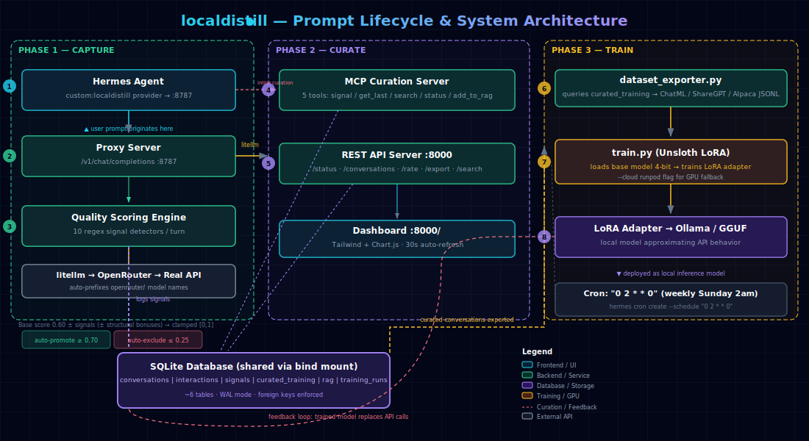

# localdistill

Capture your API model conversations → curate → train your own local model.

**Phase 1 (built):** Proxy captures every API call to SQLite, auto-detects quality signals.
**Phase 2 (built):** MCP server for inline curation during conversations.
**Phase 3 (next):** LoRA fine-tuning pipeline from curated conversations.

## Quick Start

```bash
cd ~/localdistill

# 1. Add your API keys
cp .env.example .env
# Edit .env with your keys

# 2. Start the proxy
./run_proxy.sh

# 3. Point your tools to http://localhost:8787/v1
# Every API call is now logged, scored, and stored.
```

## MCP Curation Server

Add to your MCP client (Hermes, Claude Desktop, etc.):

```bash
hermes mcp add localdistill --command "python ~/localdistill/mcp_server.py"
```

Available slash commands/tools:
- `/signal_quality` — mark conversation as good/bad for training
- `/get_last_conversation` — check recent quality score
- `/search_knowledge` — search the RAG knowledge base
- `/get_training_status` — training pipeline overview
- `/add_to_rag` — manually index a conversation

## Architecture



### Prompt Lifecycle

1. **Capture** — Hermes routes to `custom:localdistill` → Proxy :8787 logs every request/response to SQLite
2. **Score** — 10 regex signal detectors run on each user message (hallucination, correction, acceptance, etc.)
3. **Finalize** — Auto-finalizer computes quality score (base 0.60 ± signals ± structural bonuses) after 5-min idle timeout
4. **Curate** — MCP tools or Dashboard override scores inline: auto-promote ≥ 0.70, auto-exclude ≤ 0.25
5. **Export** — `dataset_exporter.py` queries `curated_training` table → ChatML / ShareGPT / Alpaca JSONL
6. **Train** — `train.py` loads base model with Unsloth 4-bit, trains LoRA adapter, exports GGUF + Modelfile
7. **Deploy** — LoRA adapter → Ollama for local inference, closing the feedback loop

## Files

- `db.py` — SQLite schema + queries
- `quality.py` — Signal detection + scoring
- `proxy_server.py` — FastAPI proxy server
- `mcp_server.py` — MCP curation server
- `proxy_config.yaml` — LiteLLM config (alternative)
- `run_proxy.sh` — Startup script